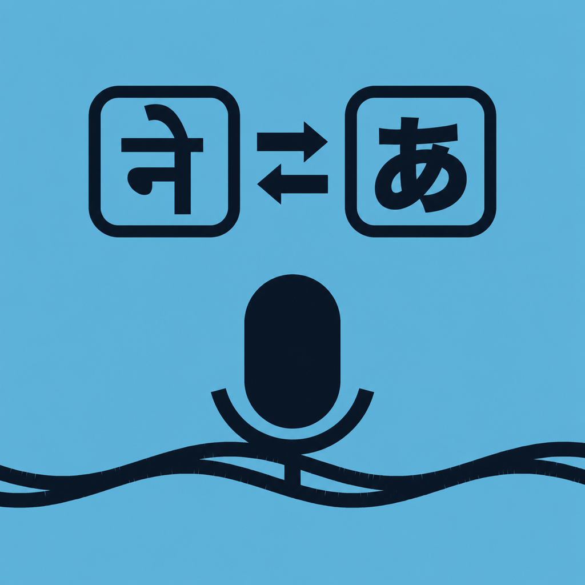

# BridgeTTS



日本語と英語のリアルタイム音声翻訳アプリです。音声認識で文字起こしし、OpenAI API（gpt-4.1-nano）で翻訳、Web Speech APIで音声読み上げ（TTS）します。**PWA（ブラウザ）** と **iOSネイティブアプリ（AltStore配布）** の2形態で動作します。

- 更新履歴: [CHANGELOG.md](CHANGELOG.md)
- iOSアプリのビルド・インストール手順: [docs/IOS_APP.md](docs/IOS_APP.md)
- 図解仕様書: [docs/VISUAL_GUIDE.html](docs/VISUAL_GUIDE.html)

## インストール

### iOSネイティブアプリ（推奨）

1. AltStore/AltServerをセットアップ（初回のみ。[docs/IOS_APP.md](docs/IOS_APP.md)参照）
2. iPhoneのSafariで **https://aichirofunakoshi.github.io/Bridge-TTS-Codex-/altstore.html** を開き「AltStoreにソースを追加」
3. AltStoreの Browse から BridgeTTS をインストール

以後の更新はAltStoreの「アップデート」からワンタップで行えます（設定・履歴・APIキーは引き継がれます）。

### PWA（ブラウザ）

1. https://aichirofunakoshi.github.io/Bridge-TTS-Codex-/ をSafari（iOS）/Chrome（Android）で開く
2. iPhone/iPad: 共有ボタン →「ホーム画面に追加」 / Android: メニュー →「アプリをインストール」

### 必要なもの

- OpenAI APIキー（[取得はこちら](https://platform.openai.com/api-keys)）
- APIキーは端末のlocalStorageにのみ保存され、翻訳時にOpenAI APIへ直接送信されます。リポジトリやサーバーには保存されません。共有端末では使用後に「APIキーリセット」を実行してください。

## 主な機能

- **リアルタイム音声翻訳**: 日本語⇄英語の双方向翻訳。話しながらストリーミングで翻訳結果を表示
- **音声認識の誤り補正**: 同音異義語の誤変換や助詞の欠落を、翻訳時に文脈から推定して修正
- **TTS（音声読み上げ）**: 翻訳ボックスをタップで再生/停止。設定でON/OFF・速度（×0.8〜×1.2）を調整可能
- **会話モード（オプション）**: 音声入力の停止後、最後の翻訳結果を自動で読み上げ（デフォルトOFF。対面会話でタップの手間を削減）
- **ターン制の会話フロー**: TTS実行＝1ターンの終了として音声入力を自動停止。次の入力は言語ボタンから開始（TTS後の認識再開による冒頭欠け・精度低下を防止し、日英の言語切替も自然に）。30秒間無音の場合も自動停止（電池・発熱対策）
- **会話履歴**: 直近20件をヘッダーの履歴ボタンから専用画面で閲覧。各エントリの再生・コピー、全消去に対応。端末内（localStorage）にのみ保存
- **デバウンス最適化（学習型）**: デフォルト値（日本語346ms/英語154ms）から、音声認識の更新間隔を学習して翻訳開始の待ち時間を言語別に自己最適化（90パーセンタイル×1.2）。日英は独立しており、片方の言語が30件に達すればその言語だけで最適化可能
- **テーマ切替**: 自動（端末設定に追従）/ライト/ダーク
- **フォントサイズ調整**: 小/中/大/特大の4段階
- **レスポンシブレイアウト**: 横画面では原文と翻訳を左右並列表示
- **視覚的状態フィードバック**: 録音中（青）/翻訳中（オレンジ）/完了（緑）を色で表示
- **エラー報告**: エラー発生時に「⚠️ エラーを報告」ボタンが出現。ネイティブアプリではGitHub Issuesへ直接送信（アカウント不要・APIキー等は自動マスク）、Web版ではIssue下書き画面を開く

## iOSネイティブアプリの仕組み

WKWebViewでWebアプリ本体をそのまま動かし、WKWebViewに存在しない音声認識（webkitSpeechRecognition）をネイティブの `SFSpeechRecognizer` ブリッジ（`native-speech.js` + Swift）で補完しています。Webアプリ本体は両環境で共通です。

- `v*` タグのpushで、GitHub Actionsが未署名IPAをビルドしReleaseに添付
- 併せてAltStoreソース（apps.json）がGitHub Pagesへ自動公開され、AltStoreに更新が配信される

## 開発

```bash
git clone https://github.com/AichiroFunakoshi/Bridge-TTS-Codex-.git
cd Bridge-TTS-Codex-

# Node 22を使用（Playwright 1.60はNode 24/25で不安定なため）
nvm use  # .nvmrc準拠。Homebrewの場合: export PATH="/opt/homebrew/opt/node@22/bin:$PATH"

npm install
npx playwright install chromium
npm run test:smoke -- --reporter=line
```

ローカル確認は `python3 -m http.server 4173` などで配信して `http://127.0.0.1:4173` を開きます（マイクを使う場合はHTTPSまたはlocalhostが必要）。iOSアプリのローカルビルドは [docs/IOS_APP.md](docs/IOS_APP.md) を参照してください。

### リリース手順

1. `ios/project.yml` の `MARKETING_VERSION`、`index.html` のバージョン表記（タイトル・フッター）、`tests/smoke.test.js` の期待値を更新
2. `CHANGELOG.md` に変更内容を記録
3. PRをmainへマージ後、`git tag vX.Y.Z && git push origin vX.Y.Z`
4. 以降は自動（IPAビルド → Release添付 → AltStoreソース更新）

### 主要ファイル

| ファイル | 役割 |
|---|---|
| `app.js` | アプリ本体（音声認識制御・翻訳トリガー・UI） |
| `translator-service.js` | OpenAI API（gpt-4.1-nano）ストリーミング翻訳 |
| `prompt-service.js` | 翻訳システムプロンプト（誤認識の文脈修正ルールを含む） |
| `tts-service.js` | 音声読み上げ（ネイティブ時はオーディオセッション切替＋ウォームアップ） |
| `native-speech.js` | iOSネイティブ音声認識ブリッジ（Web側） |
| `error-reporter.js` | エラー収集・マスク・GitHub Issues報告 |
| `ios/` | Swiftソース・XcodeGen設定・ビルドスクリプト |
| `altstore/generate_source.py` | AltStoreソース(apps.json)とPagesサイトの生成 |

## ブラウザ対応（PWA）

- iOS Safari / Android Chrome / Edge: 対応
- Firefox Mobile: 非対応（Web Speech API非搭載）

## 既知の制限

- 翻訳にはインターネット接続とOpenAI APIキーが必要（使用量に応じてAPI料金が発生）
- 対応言語ペアは日本語⇄英語のみ
- 無料Apple IDでのサイドロードは7日ごとの再署名（AltStoreが自動更新）と3アプリ制限あり
